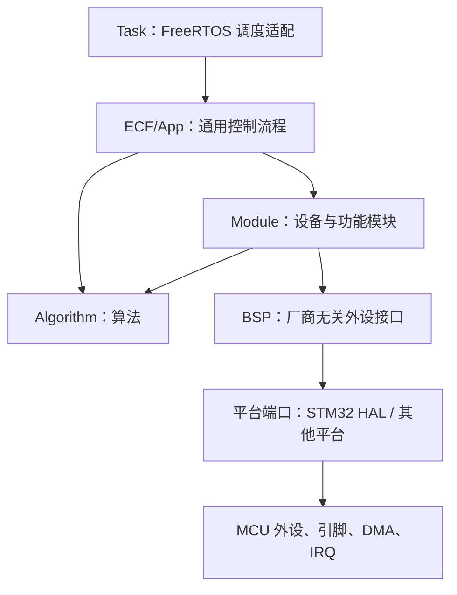

# RoboNava_ECF — Embedded Control Framework

RoboNava_ECF 是面向 RoboMaster 竞赛的**可移植嵌入式控制框架**，不绑定任何具体机器人、MCU 型号或 FreeRTOS 实例。

核心原则：**静态内存、显式依赖、C 语言面向对象、算法与硬件解耦。**

---

## 目录

- [框架-项目分离](#框架-项目分离)
- [整体架构](#整体架构)
- [结构体命名规则](#结构体命名规则)
- [C 语言对象模型](#c-语言对象模型)
- [算法层](#算法层)
- [BSP 层](#bsp-层)
- [Module 层](#module-层)
- [DJI 与 DM 电机调用](#dji-与-dm-电机调用)
- [App 层](#app-层)
- [主要可读数据](#主要可读数据)
- [通信协议](#通信协议)
- [快速开始](#快速开始)
- [移植到新平台](#移植到新平台)
- [Ozone 调试](#ozone-调试)
- [进一步文档](#进一步文档)

---

## 框架-项目分离

ECF 是通用框架部分，不保存某一台机器人的 CAN ID、板级句柄或任务实例。具体机器人项目放在 ECF 之外：

```text
your_robot_project/
├── ECF/                       ← 通用框架（跨项目复用）
│   ├── Algorithm/             与硬件无关的数学、滤波、估计、控制和底盘运动学
│   ├── Bsp/                   GPIO、总线、定时器等厂商无关外设对象
│   ├── Module/                电机、传感器、遥控器、通信和功能设备
│   └── App/                   跨项目复用的 App 组件（命令、安全、控制流程、数据交换）
│
├── App/                        ← 当前机器人实例与板级装配（换机器人主要改这里）
│   ├── config/
│   │   ├── project_config.h   集中式参数配置（PID、CAN ID、功能开关…）
│   │   └── board_config.h/.c  HAL 外设映射、对象存储、驱动操作表与回调路由
│   ├── robot/                 当前机器人对象、设备/控制装配与失败回滚
│   └── task/                  FreeRTOS 任务入口（周期调度 → 调用 App 更新）
│
├── Core/                       CubeMX 生成（不动）
├── Drivers/                    STM32 HAL（不动）
└── Middlewares/                FreeRTOS、USB（不动）
```

移植到新机器人时只需修改 `App/` 下的文件。框架 `ECF/` 完全不动。

---

## 整体架构



依赖只能向下：

- `Algorithm` 不依赖 HAL、RTOS、BSP、Module 或 App。
- 通用 `Bsp` 不直接保存某个 STM32 全局句柄，通过 `device_handle + driver_ops` 接入平台。
- GPIO、EXTI、PWM 使用平台操作表和轻量资源句柄；CAN、USART、SPI 等通信外设使用可实例化的完整 BSP 对象。
- `Module` 只依赖所需的 BSP 和算法，不反向依赖 App。
- `ECF/App` 保存可跨机器人复用的命令模型、安全监控、数据交换和控制流程，不选择具体 HAL 外设。
- 根目录 `App` 负责当前机器人的实例、硬件选择、参数、角色、初始化顺序和项目策略。

典型数据流：

```text
硬件接收
  → BSP 完成收发
  → Module 校验协议并形成强类型数据
  → Algorithm 估计或解算
  → App 决策
  → Module 生成执行器目标
  → BSP 发送到硬件
```

---

## 结构体命名规则

每个组件的公开头文件就是其完整 API。结构体名称遵循统一约定：

| 后缀或名称                           | 含义                               | 生命周期                                         |
| ------------------------------------ | ---------------------------------- | ------------------------------------------------ |
| `*_config_t`                         | 初始化配置、依赖对象、限幅和参数   | 通常只在初始化时读取；指针成员必须按注释保持有效 |
| `*_t`                                | 组件运行对象，保存状态、缓存和依赖 | 由调用者静态创建；初始化后只通过指针使用         |
| `*_data_t`                           | 已解析或已换算的业务数据           | 通常保存在对象内，通过 `get_data()` 获取只读指针 |
| `*_raw_data_t`                       | 未换算的传感器或协议原始值         | 用于标定和调试                                   |
| `*_feedback_t`                       | 执行器反馈                         | 位置、速度、电流、温度、在线状态等               |
| `*_state_t`                          | 状态机、算法或诊断运行状态         | 可通过 getter 读取                               |
| `*_input_t` / `*_command_t`          | 单次更新输入或目标命令             | 调用更新函数时传入                               |
| `*_target_t` / `*_solution_t`        | 解算结果                           | 由正解、逆解或控制器写入                         |
| `*_statistics_t` / `*_diagnostics_t` | 计数器与诊断量                     | 用于在线监控和调参                               |
| `*_ops_t`                            | 面向调用者的操作表或虚表           | 只读，通常由实现文件静态定义                     |
| `*_driver_ops_t`                     | 平台驱动回调表                     | 由平台端口实现并注入 BSP                         |
| `*_status_t`                         | 函数返回状态码                     | 调用者应检查，不使用模糊的 `0/-1`                |

**前缀体系：**

| 前缀      | 含义                             | 示例                                          |
| --------- | -------------------------------- | --------------------------------------------- |
| `alg_`    | Algorithm — 纯算法               | `alg_pid_t`, `alg_filter_low_pass_init()`     |
| `bsp_`    | Board Support Package — 外设驱动 | `bsp_can_t`, `bsp_spi_transmit()`             |
| `module_` | 设备模块                         | `module_dji_motor_t`, `module_swerve_init()`  |
| `app_`    | Application — 应用逻辑           | `app_chassis_t`, `app_exchange_publish_imu()` |

**函数命名：** `<prefix>_<module>_<verb>_<noun>()`

| 动词                            | 含义                        |
| ------------------------------- | --------------------------- |
| `init`                          | 初始化对象                  |
| `reset`                         | 重置状态到初始值            |
| `update`                        | 周期更新（接收 `dt` 参数）  |
| `get_*` / `read_*`              | 读取值 / 读取数据           |
| `set_*`                         | 设置值 / 修改配置           |
| `enable` / `disable`            | 使能 / 禁用输出             |
| `start` / `stop`                | 启动 / 停止硬件外设         |
| `send` / `receive` / `transmit` | 数据传输                    |
| `publish_*` / `read_*`          | 发布 / 读取（app_exchange） |

**SI 单位约定：** `_rad`（弧度）、`_rad_per_s`（弧度/秒）、`_m_per_s2`（m/s²）、`_c`（°C）、`_a`（安培）、`_hz`（Hz）、`_s`（秒）、`_ms`（毫秒）、`_us`（微秒）

---

## C 语言对象模型

- 基类对象放在派生对象第一个成员，名称通常为 `super`。
- 派生实现使用 `*_STATIC_ASSERT_SUPER_FIRST()` 在编译期检查结构体布局。
- 基类通过只读 `vptr` 调用派生实现；派生使用 `CONTAINER_OF` 从基类恢复完整对象。
- 多个实例共享只读操作表，各自保存运行状态。
- 构造函数校验必须操作；缺失的可选操作返回 `*_STATUS_UNSUPPORTED`。
- 不使用 `malloc`；对象、数组、工作区和 DMA 缓冲区均由调用者提供。
- 初始化后的对象不能按值复制，否则内部指针可能失效。
- ISR 只完成通知、缓存或置位；解析和控制在任务上下文执行。

**多态使用边界：** 只有同一公共接口确实存在两种以上可替换实现时，才使用 `super + vptr + container_of`。PID、LQR、滤波、运动学等没有替换需求的组件继续使用普通结构体和普通函数。

```c
// 多态调用示例（电机基类 → DJI 电机派生类）
module_motor_t *motor = &dji_m3508.super;           // 向上转型（隐式）
module_motor_enable(motor);                          // 通过 vptr→enable() 调到派生实现
const module_motor_feedback_t *fb = module_motor_get_feedback(motor);  // 统一读取反馈
```

**驱动抽象表（bsp_can 为例）：**

```c
// 平台无关的驱动操作表，由 board_config 注入
typedef struct {
    bsp_status_t (*transmit)(void *, const bsp_can_frame_t *, uint32_t);
    bsp_status_t (*receive)(void *, bsp_can_receive_fifo_t, bsp_can_frame_t *);
    // ...
} bsp_can_driver_ops_t;

// F405 bxCAN 和 H723 FDCAN 都实现同一张表，上层 Module / App 无感知
```

---

## 算法层

目录 `ECF/Algorithm`。全部使用 SI 单位和显式时间步长。不包含 HAL、BSP、Module 或 RTOS 头文件。

| 组件                 | 主要结构体                                                                                                                                                                                                   | 输入                                | 输出或可观察数据                                            |
| -------------------- | ------------------------------------------------------------------------------------------------------------------------------------------------------------------------------------------------------------ | ----------------------------------- | ----------------------------------------------------------- |
| `alg_crc`            | `alg_crc_config_t`                                                                                                                                                                                           | 数据、位宽、多项式、初值、位序      | 统一 CRC8/CRC16/CRC32 结果                                  |
| `alg_math`           | `alg_math_vector2_t`、`alg_math_vector3_t`、`alg_math_quaternion_t`、`alg_math_matrix_t`、`alg_math_statistics_t`                                                                                            | 标量、向量、矩阵、样本              | 向量/矩阵结果，均值、方差、标准差；含一维查表与双线性插值   |
| `alg_filter`         | `alg_filter_low_pass_t`、`alg_filter_high_pass_t`、`alg_filter_exponential_t`、`alg_filter_moving_average_t`、`alg_filter_median_t`、`alg_filter_fir_t`、`alg_filter_biquad_t`、`alg_filter_complementary_t` | 新采样值、时间步长                  | 滤波输出以及对象内部历史状态                                |
| `alg_kalman`         | `alg_kalman_scalar_t`、`alg_kalman_linear_t`、`alg_kalman_extended_t`                                                                                                                                        | 状态、测量、模型函数、噪声矩阵      | 状态估计、协方差和创新计算结果                              |
| `alg_attitude`       | `alg_attitude_config_t`、`alg_attitude_quaternion_t`、`alg_attitude_rotation_matrix_t`、`alg_attitude_t`                                                                                                     | 三轴陀螺仪、三轴加速度计、`dt`      | 四元数、旋转矩阵、roll/pitch/yaw；支持 Mahony 与 Madgwick   |
| `alg_imu_ekf`        | `alg_imu_ekf_config_t`、`alg_imu_ekf_quaternion_t`、`alg_imu_ekf_euler_t`、`alg_imu_ekf_diagnostics_t`、`alg_imu_ekf_t`                                                                                      | 六轴 IMU 数据、`dt`                 | 四元数、欧拉角、陀螺零偏、校正角速度、重力方向和 EKF 诊断量 |
| `alg_pid`            | `alg_pid_config_t`、`alg_pid_input_t`、`alg_pid_terms_t`、`alg_pid_t`                                                                                                                                        | 目标、反馈、前馈、`dt`              | P/I/D/FF 分量、限幅前输出和最终输出                         |
| `alg_pid` 串级       | `alg_pid_cascade_t`、`alg_pid_angle_t`                                                                                                                                                                       | 位置、速度反馈、前馈、`dt`          | 速度目标、串级输出和角度控制输出                            |
| `alg_lqr`            | `alg_lqr_config_t`、`alg_lqr_t`                                                                                                                                                                              | 状态、参考、固定增益矩阵和前馈      | 限幅后的固定增益状态反馈控制量                              |
| `alg_trajectory`     | `alg_trajectory_config_t`、`alg_trajectory_state_t`、`alg_trajectory_t`、`alg_trajectory_group_t`                                                                                                            | 位置/速度目标、约束、`dt`           | 位置、速度、加速度轨迹；梯形速度与 S 曲线                   |
| `alg_chassis`        | `alg_chassis_velocity_t`、`alg_chassis_pose_t`、`alg_chassis_constraint_t`、`alg_chassis_solution_t`                                                                                                         | 轮速约束或车体速度                  | 降级速度解、拟合残差、里程计位姿                            |
| `alg_chassis` 轮状态 | `alg_chassis_wheel_monitor_config_t`、`alg_chassis_wheel_monitor_wheel_state_t`                                                                                                                              | 各轮残差                            | 故障/恢复计数和每轮故障标志                                 |
| `alg_mecanum`        | `alg_mecanum_config_t`、`alg_mecanum_t`                                                                                                                                                                      | `alg_chassis_velocity_t` 或四轮速度 | 四轮麦克纳姆逆解、正解和里程计                              |
| `alg_omni`           | `alg_omni_wheel_config_t`、`alg_omni_t`                                                                                                                                                                      | 车体速度或任意数量全向轮速度        | 通用全向轮逆解、加权正解和里程计                            |
| `alg_swerve`         | `alg_swerve_command_t`、`alg_swerve_module_target_t`、`alg_swerve_t`                                                                                                                                         | 车体命令、舵角和轮速                | 任意数量舵轮目标、正解和目标优化                            |

当前底盘解算只保留三类：麦克纳姆轮 `alg_mecanum`、全向轮 `alg_omni`、舵轮 `alg_swerve`。没有差速底盘和 Ackermann 解算。

### 算法层重点输出结构体

**`alg_chassis_velocity_t`**

| 字段                         | 数据            |
| ---------------------------- | --------------- |
| `velocity_x_m_per_s`         | 车体 X 方向速度 |
| `velocity_y_m_per_s`         | 车体 Y 方向速度 |
| `angular_velocity_rad_per_s` | 绕 Z 轴角速度   |

**`alg_chassis_solution_t`**

| 字段                                | 数据                               |
| ----------------------------------- | ---------------------------------- |
| `velocity`                          | 解算出的底盘速度                   |
| `residual_root_mean_square_m_per_s` | 约束拟合残差，用于判断轮速是否一致 |
| `used_constraint_count`             | 实际参与解算的约束数               |
| `is_degraded`                       | 是否处于缺轮或缺约束的降级解算     |

**`alg_pid_terms_t`**

| 字段                 | 数据                       |
| -------------------- | -------------------------- |
| `proportional`       | 比例项                     |
| `integral`           | 积分项                     |
| `derivative`         | 微分项                     |
| `feedforward`        | 速度、加速度和额外前馈之和 |
| `unsaturated_output` | 限幅前输出                 |
| `output`             | 最终限幅输出               |

**`alg_trajectory_state_t`**

| 字段                  | 数据           |
| --------------------- | -------------- |
| `position`            | 当前规划位置   |
| `velocity_per_s`      | 当前规划速度   |
| `acceleration_per_s2` | 当前规划加速度 |

**`alg_imu_ekf_diagnostics_t`**

| 字段                             | 数据                             |
| -------------------------------- | -------------------------------- |
| `filtered_accelerometer_m_s2[3]` | 低通滤波后的三轴加速度           |
| `innovation[3]`                  | 三维创新残差                     |
| `accelerometer_norm_m_s2`        | 原始加速度模长                   |
| `accelerometer_deviation_g`      | 相对 1g 的偏差                   |
| `normalized_innovation_squared`  | NIS，一致性诊断量                |
| `measurement_noise_scale`        | 当前自适应测量噪声倍率           |
| `was_accelerometer_used`         | 最近一次更新是否接受了加速度观测 |
| `has_converged`                  | EKF 是否已收敛                   |
| `rejection_count`                | 连续观测拒绝计数                 |

---

## BSP 层

目录 `ECF/Bsp`。通用 BSP 对象不决定使用哪个外设实例或引脚。具体引脚、HAL 操作表、CubeMX 句柄绑定、对象存储和回调路由集中在项目的 `App/config/board_config.h/.c`。

| BSP                      | 主要结构体                                           | 能读取或观察的数据                                                          |
| ------------------------ | ---------------------------------------------------- | --------------------------------------------------------------------------- |
| `bsp_common`             | `bsp_status_t`、`bsp_transfer_mode_t`、`bsp_event_t` | 统一状态码、阻塞/中断/DMA 模式和事件类型；全局错误寄存器 `bsp_error_read()` |
| `bsp_gpio`               | `bsp_gpio_t`、`bsp_gpio_config_t`                    | `bsp_gpio_read()` 读取高低电平                                              |
| `bsp_exti`               | `bsp_exti_t`、`bsp_exti_config_t`                    | 通过回调观察外部中断事件                                                    |
| `bsp_usart`              | `bsp_usart_t`、`bsp_usart_config_t`                  | 收发完成/错误回调，`bsp_usart_get_busy()`                                   |
| `bsp_spi`                | `bsp_spi_t`、`bsp_spi_config_t`                      | 收发完成/错误回调，`bsp_spi_get_busy()`                                     |
| `bsp_i2c`                | `bsp_i2c_t`、`bsp_i2c_config_t`                      | 内存读写、设备就绪状态和总线忙状态                                          |
| `bsp_can`                | `bsp_can_frame_t`、`bsp_can_filter_t`、`bsp_can_t`   | 接收帧、发送邮箱余量和事件回调                                              |
| `bsp_can` 分发器         | `bsp_can_route_t`、`bsp_can_dispatcher_t`            | 按 ID/掩码将帧路由到模块；接收/未匹配/错误帧计数                            |
| `bsp_fdcan`              | `bsp_fdcan_frame_t`、`bsp_fdcan_t`                   | CAN FD 帧、协议状态和发送余量                                               |
| `bsp_fdcan` Classic 适配 | `bsp_fdcan_classic_adapter_t`                        | 将 Classic CAN 风格模块接到 FDCAN                                           |
| `bsp_timer`              | `bsp_timer_t`、`bsp_timer_config_t`                  | 计数值、周期和频率                                                          |
| `bsp_pwm`                | `bsp_pwm_t`、`bsp_pwm_config_t`                      | 频率、脉宽计数和占空比                                                      |
| `bsp_encoder`            | `bsp_encoder_t`、`bsp_encoder_config_t`              | 计数、增量和方向                                                            |
| `bsp_adc`                | `bsp_adc_t`、`bsp_adc_config_t`                      | 原始 ADC、归一化值和电压                                                    |
| `bsp_usb_vcp`            | `bsp_usb_vcp_t`、`bsp_usb_vcp_config_t`              | 连接状态、忙状态和接收事件                                                  |
| `bsp_watchdog`           | `bsp_watchdog_t`、`bsp_watchdog_config_t`            | 超时时间和看门狗复位标志                                                    |
| `bsp_dwt`                | `bsp_dwt_t`、`bsp_dwt_config_t`                      | DWT 周期计数、计数频率和时间差                                              |
| `bsp_log`                | 通过宏调用，无对象结构                               | SEGGER RTT 日志输出                                                         |

板级可读对象通过项目的 `board_config_get_can()`、`board_config_get_usart()` 等 getter 获得。通用 BSP 本身不提供任何具体开发板 getter。

### H723 board_config 使用顺序（参考）

CubeMX 完成 HAL 外设初始化后，再初始化板级 BSP 对象：

```c
#include "board_config.h"

// 初始化板级装配
const board_config_init_t board_init = { .initialize_watchdog = false };
board_config_init(&board_init);

// getter 返回通用 BSP 基类；Module 不接触 hfdcan1、huart5 等 HAL 句柄
bsp_can_t    *can1 = board_config_get_can(BOARD_CONFIG_CAN_1);
bsp_usart_t  *dr16_uart = board_config_get_usart(BOARD_CONFIG_UART_DR16);
bsp_spi_t    *bmi088_spi = board_config_get_bmi088_spi();
bsp_usb_vcp_t *usb_vcp = board_config_get_usb_vcp();
```

### F405 与 H723 的 CAN 边界

- F405 的 bxCAN 和 H723 的 FDCAN Classic 模式统一通过 `bsp_can_t` 向 Module 提供 0~8 字节 Classic CAN 帧。
- H723 的平台端使用 HAL FDCAN 实现 `bsp_can_driver_ops_t`，不要求电机或板间通信改用芯片专用类型。
- 只有使用 12~64 字节 CAN FD 帧、BRS 或 FDCAN 协议状态时，才使用 `bsp_fdcan_t` 扩展接口。
- F405 不能接收 CAN FD 帧；两种 MCU 互通时 H723 必须发送 Classic CAN 帧。

---

## Module 层

目录 `ECF/Module`。模块负责设备协议、状态机和业务数据，不负责决定板上具体引脚。

| 模块                  | 主要结构体                                                                                                                       | 功能                                          | 对外可读数据                                              |
| --------------------- | -------------------------------------------------------------------------------------------------------------------------------- | --------------------------------------------- | --------------------------------------------------------- |
| `module_motor`        | `module_motor_t`、`module_motor_feedback_t`、`module_motor_ops_t`                                                                | 通用电机基类与虚表                            | 名称、ID、dt、累计运行时间、状态及完整反馈                |
| `module_dji_motor`    | `module_dji_motor_t`、`module_dji_motor_bus_t`                                                                                   | DJI M2006/M3508/GM6020 CAN 协议与三级串级 PID | 电流/速度/角度 PID 内部项、各级目标、CAN 映射及命令       |
| `module_dm_motor`     | `module_dm_motor_t`、`module_dm_limits_t`                                                                                        | 达妙电机 MIT、位置速度等控制                  | 通用反馈、故障码、MOS 温度                                |
| `module_dm_motor_bus` | `module_dm_motor_bus_t`                                                                                                          | 达妙 CAN 总线分发                             | 反馈处理状态                                              |
| `module_bmi088`       | `module_bmi088_raw_data_t`、`module_bmi088_process_data_t`、`module_bmi088_t`                                                    | BMI088 初始化、读取、换算、零偏标定           | 原始计数、加速度 m/s²、角速度 rad/s、温度、时间戳和有效性 |
| `module_dr16`         | `module_dr16_process_data_t`、`module_dr16_t`                                                                                    | DR16/DBUS 双 DMA 接收与解码                   | 摇杆、开关、鼠标、键盘、拨轮、统计和在线状态              |
| `module_swerve`       | `module_swerve_t`、`module_swerve_config_t`                                                                                      | 单个舵轮的转向与驱动执行                      | 当前舵角；接收 `alg_swerve_module_target_t`               |
| `module_shooter`      | `module_shooter_t`、`module_shooter_state_t`                                                                                     | 双摩擦轮与拨弹电机状态机                      | 状态、待发弹量和卡弹重试次数                              |
| `module_servo`        | `module_servo_t`、`module_servo_config_t`                                                                                        | 标准 PWM 舵机                                 | 当前命令角度                                              |
| `module_buzzer`       | `module_buzzer_note_t`、`module_buzzer_t`                                                                                        | 音符、频率和时序播放                          | 是否正在播放                                              |
| `module_ws2812`       | `module_ws2812_color_t`、`module_ws2812_effect_state_t`、`module_ws2812_t`                                                       | 灯珠帧缓冲和内置效果                          | 忙状态和效果运行状态                                      |
| `module_oled`         | `module_oled_t`、`module_oled_config_t`                                                                                          | I2C 单色页式 OLED 帧缓冲                      | 对象内帧缓冲和初始化状态                                  |
| `module_nrf24l01`     | `module_nrf24l01_t`、`module_nrf24l01_link_t`、`module_nrf24l01_link_packet_t`                                                   | nRF24L01 原始收发与独立 ACE 链路协议          | 收到的数据包、序号、管道号和重发/丢包统计                 |
| `module_uart_comm`    | `module_uart_comm_process_data_t`、`module_uart_comm_t`                                                                          | 普通 UART 独立固定帧协议                      | 原始数据区、更新计数和 CRC 统计                           |
| `module_usb_comm`     | `module_usb_comm_data_t`、`module_usb_comm_t`                                                                                    | USB CDC 视觉 mode/ID 协议                     | mode、ID、扩展区和解析统计                                |
| `module_board_comm`   | `module_board_comm_remote_process_data_t`、`module_board_comm_gimbal_process_data_t`、`module_board_comm_chassis_process_data_t` | 云台板与底盘板 Classic CAN 通信               | 遥控、云台、底盘、发射机构数据和各链路在线状态            |
| `module_referee`      | `module_referee_t`                                                                                                               | RoboMaster 裁判系统协议解析与 UI 绘制         | 比赛状态、血量、弹药、功率、底盘功率限制等                |

---

## DJI 与 DM 电机调用

DJI 和 DM 共用 `module_motor_t` 的名称、状态、反馈、`dt` 和运行时间，但 CAN 调度不同：

| 电机 | 目标设置 | 周期入口 | CAN 发送方式 |
| --- | --- | --- | --- |
| DJI M2006/M3508/GM6020 | `module_motor_set_target()` 或 DJI 专用 setter | `module_dji_motor_bus_update()` | 同组 4 台电机打包成一帧 |
| DM/DM4310 | `module_dm_motor_set_*_target()` | `module_dm_motor_bus_update()` | 每台电机独立一帧，按预算轮询 |

### DJI 电机

```c
static module_dji_motor_bus_t dji_bus;
static module_dji_motor_t chassis_1;

module_dji_motor_bus_init(&dji_bus, &can1, 1U);
module_dji_motor_init(&chassis_1, &(module_dji_motor_config_t){
    .name = "chassis_1",
    .motor_bus = &dji_bus,
    .motor_model = MODULE_DJI_MOTOR_M3508,
    .control_mode = MODULE_DJI_CONTROL_DIRECT,
    .motor_identifier = 1U,
    .direction_sign = 1.0F,
    .maximum_temperature_c = 80.0F,
    .position_reference = MODULE_DJI_POSITION_BOOT_RELATIVE,
});
module_dji_motor_register(&chassis_1);
module_motor_enable(module_dji_motor_as_base(&chassis_1));

/* 1 kHz 任务：先设目标，再更新一次总线 */
module_motor_set_target(module_dji_motor_as_base(&chassis_1), command);
module_dji_motor_bus_update(&dji_bus, dt_s);
```

电流、速度或角度环模式还需在配置中填入对应 PID 和 `current_scale_a_per_count`。CAN 接收回调将帧交给 `module_dji_motor_bus_handle_feedback()`。

### DM 电机

```c
#define DM_COUNT 2U
static module_dm_motor_t *dm_storage[DM_COUNT];
static module_dm_motor_bus_t dm_bus;
static module_dm_motor_t gimbal_yaw;

module_dm_motor_bus_init(&dm_bus, &can1, dm_storage, DM_COUNT, DM_COUNT);
module_dm_motor_init(&gimbal_yaw, &(module_dm_motor_config_t){
    .name = "gimbal_yaw",
    .motor_bus = &dm_bus,
    .control_mode = MODULE_DM_MODE_MIT,
    .master_identifier = 1U,
    .feedback_identifier = 0x11U,
    .transmit_timeout_ms = 1U,
    .limits = project_dm_limits, /* 必须与电机固件 PMAX/VMAX/TMAX/KP/KD 一致 */
});
module_dm_motor_register(&gimbal_yaw);
module_motor_enable(module_dm_motor_as_base(&gimbal_yaw));

/* 1 kHz 任务：setter 只保存目标，bus_update 才编码并发送 */
module_dm_motor_set_mit_target(&gimbal_yaw, &(module_dm_mit_command_t){
    .position_rad = yaw_target_rad,
    .velocity_rad_per_s = 0.0F,
    .proportional_gain = yaw_kp,
    .derivative_gain = yaw_kd,
    .torque_nm = 0.0F,
});
module_dm_motor_bus_update(&dm_bus, dt_s);
```

速度、位置速度和力位模式分别调用 `module_dm_motor_set_velocity_target()`、`module_dm_motor_set_position_velocity_target()` 和 `module_dm_motor_set_force_position_target()`；不要在 setter 后再单独调用 `module_motor_update()`。CAN 接收回调将帧交给 `module_dm_motor_bus_handle_feedback()`。

DM 的使能/失能、设零和参数读写是独立协议命令，仍使用 `module_motor_enable()` / `module_motor_disable()` 和 `module_dm_motor_*parameter*()` 接口立即发送。安全门关关闭时，DM 总线会立即失能所有已启用电机，不受每周期发送预算限制。

两类电机的通用调试数据：

```c
const char *name = module_motor_get_name(motor);
float dt = module_motor_get_last_delta_time_s(motor);
uint64_t runtime_us = module_motor_get_enabled_runtime_us(motor);
const module_motor_feedback_t *feedback = module_motor_get_feedback(motor);
```

---

## App 层

目录 `ECF/App`。编排 Module 和 Algorithm，提供可跨项目复用的控制流程。通用 App 可以接收 Module/BSP 对象和配置，但不能写死某辆机器人的 CAN ID、电机数量或 HAL 外设。

| 模块           | 主要结构体                                                                                                                                                                                         | 功能                                                               |
| -------------- | -------------------------------------------------------------------------------------------------------------------------------------------------------------------------------------------------- | ------------------------------------------------------------------ |
| `app_exchange` | 无对象，纯函数接口                                                                                                                                                                                 | 模块间临界区保护的单元素数据交换（publish/read）                   |
| `app_types`    | `app_chassis_command_t`、`app_gimbal_command_t`、`app_shooter_command_t`、`app_imu_snapshot_t`、`app_gimbal_feedback_t`、`app_chassis_feedback_t`、`app_shooter_feedback_t`、`app_vision_target_t` | 跨模块共享的强类型数据结构                                         |
| `app_command`  | `app_command_config_t`                                                                                                                                                                             | 遥控器输入→底盘/云台/射击器指令映射                                |
| `app_chassis`  | `app_chassis_t`、`app_chassis_config_t`                                                                                                                                                            | 底盘控制：NORMAL / SPIN / FOLLOW_GIMBAL / NO_FORCE 四种模式 + 自锁 |
| `app_gimbal`   | `app_gimbal_t`、`app_gimbal_config_t`                                                                                                                                                              | 云台双轴角度控制，支持 IMU 或编码器反馈                            |
| `app_shooter`  | `app_shooter_t`、`app_shooter_config_t`                                                                                                                                                            | 摩擦轮控制 + 拨弹盘火控逻辑（单发/连发/自动）                      |
| `app_imu`      | `app_imu_t`、`app_imu_config_t`                                                                                                                                                                    | BMI088 驱动 + EKF 姿态估计 + IMU 快照发布                          |
| `app_vision`   | `app_vision_t`、`app_vision_config_t`                                                                                                                                                              | USB CDC 视觉目标接收、超时保护和目标发布                           |
| `app_safety`   | `app_safety_monitor_t`、`app_safety_monitor_config_t`                                                                                                                                              | 最多 16 个软件心跳监控器 + 硬件看门狗；离线回调 + 状态通知         |

### app_exchange 数据交换

每类数据一个独立缓冲区，临界区保护，单生产者单消费者，无锁：

```c
app_exchange_init(NULL);  // 单线程；多任务工程传入平台锁回调

// 生产者侧
app_exchange_publish_chassis_command(&cmd);   // app_command → app_chassis
app_exchange_publish_gimbal_command(&cmd);    // app_command → app_gimbal
app_exchange_publish_shooter_command(&cmd);   // app_command → app_shooter
app_exchange_publish_imu(&snapshot);          // app_imu → app_gimbal / app_command
app_exchange_publish_vision_target(&target);  // app_vision → app_gimbal
app_exchange_publish_gimbal_feedback(&fb);    // app_gimbal → app_shooter / board_comm

// 消费者侧
app_exchange_read_chassis_command(&cmd);
app_exchange_read_gimbal_command(&cmd);
app_exchange_read_imu(&snapshot);
app_exchange_read_vision_target(&target);
app_exchange_read_gimbal_feedback(&fb);
```

---

## 主要可读数据

下面列出上层最常读取的数据。完整字段和单位以对应公开头文件为准。

### 电机反馈

通过 `module_motor_get_feedback()` 获取 `const module_motor_feedback_t *`：

| 字段                           | 含义                           |
| ------------------------------ | ------------------------------ |
| `position_rad`                 | 连续或协议定义的位置，单位 rad |
| `velocity_rad_per_s`           | 角速度                         |
| `torque_nm`                    | 扭矩                           |
| `current_a`                    | 已换算电流                     |
| `motor_temperature_c`          | 电机温度                       |
| `current_raw`                  | 协议原始电流值                 |
| `raw_position`                 | 协议原始位置值                 |
| `update_count`                 | 有效反馈累计次数               |
| `elapsed_time_since_update_ms` | 距离最近反馈的时间             |
| `is_current_a_valid`           | 电流安培值是否完成可靠换算     |
| `is_online`                    | 是否在反馈超时范围内           |

M2006、M3508、GM6020、DM4310 都可通过其 `super` 电机基类读取这组统一数据。

### DR16 遥控器

通过 `module_dr16_get_data()` 获取 `const module_dr16_process_data_t *`：

| 字段                                         | 含义                                          |
| -------------------------------------------- | --------------------------------------------- |
| `channel[4]`                                 | 四路摇杆去中心原始值                          |
| `normalized_channel[4]`                      | 四路摇杆归一化值 `[-1, 1]`                    |
| `left_switch` / `right_switch`               | 左右三段开关                                  |
| `mouse_x/y/z`                                | 鼠标三轴位移                                  |
| `mouse_left_pressed` / `mouse_right_pressed` | 鼠标按键                                      |
| `keyboard`                                   | W/S/A/D/Shift/Ctrl/Q/E/R/F/G/Z/X/C/V/B 位掩码 |
| `dial` / `normalized_dial`                   | 拨轮原始值和归一化值                          |
| `valid_frame_count` / `invalid_frame_count`  | 有效帧和无效帧计数                            |
| `is_online`                                  | 遥控器是否在线                                |

### BMI088

`module_bmi088_get_raw_data()` 返回 `module_bmi088_raw_data_t`（原始计数值、温度）。`module_bmi088_get_data()` 返回 `module_bmi088_process_data_t`：

| 字段                            | 含义               |
| ------------------------------- | ------------------ |
| `acceleration_m_per_s2[3]`      | 三轴加速度 (m/s²)  |
| `angular_velocity_rad_per_s[3]` | 三轴角速度 (rad/s) |
| `temperature_c`                 | 温度 (°C)          |
| `timestamp_us`                  | 时间戳 (μs)        |
| `sample_count`                  | 累计采样次数       |
| `is_valid`                      | 数据有效性         |

这组物理量可直接送入 `alg_attitude` 或 `alg_imu_ekf`。

### 姿态数据

轻量姿态估计 `alg_attitude_t` 可读取：

- `quaternion`：`q0/q1/q2/q3`
- `alg_attitude_get_euler()`：roll、pitch、yaw
- `alg_attitude_get_rotation_matrix()`：旋转矩阵

IMU EKF 通过 getter 提供：

- `alg_imu_ekf_get_quaternion()` / `alg_imu_ekf_get_euler()`
- `alg_imu_ekf_get_gyro_bias()` / `alg_imu_ekf_get_corrected_gyroscope()`
- `alg_imu_ekf_get_gravity_body()` / `alg_imu_ekf_get_linear_acceleration_body()` / `alg_imu_ekf_get_linear_acceleration_world()`
- `alg_imu_ekf_get_diagnostics()` / `alg_imu_ekf_get_continuous_yaw()`

### 底盘与舵轮

- `alg_mecanum`：四轮速度与 `alg_chassis_velocity_t` 相互解算。
- `alg_omni`：任意数量全向轮速度与底盘速度相互解算。
- `alg_swerve`：输出每个模块的 `wheel_velocity_m_per_s` 与 `steering_angle_rad`。
- `alg_chassis_solution_t`：同时报告残差、有效约束数量和降级状态。
- `module_swerve_get_steering_angle()`：读取单个舵轮当前舵角。

### 发射机构

`module_shooter_t` 状态机：`DISABLED → READY → FEEDING → ROLLBACK → FAULT`

公开读取接口：

- `module_shooter_get_state()` / `module_shooter_get_pending_shots()`
- `module_shooter_get_jam_retry_count()` / `module_shooter_get_friction_ready()` / `module_shooter_get_fire_permission()`

拨弹盘每发使用一个完整的位置步进；速度低且电流高用于卡弹判断。

### 视觉通信

`module_usb_comm_get_data()` 返回：

| 字段                | 含义                     |
| ------------------- | ------------------------ |
| `data.mode`         | 当前模式                 |
| `data.id`           | 目标 ID，范围 1~7        |
| `data.extra_data[]` | 宏启用后的预留扩展数据区 |
| `update_count`      | 有效帧更新计数           |
| `is_valid`          | 是否至少收到过一个有效帧 |

### 板间通信

`module_board_comm` 提供以下只读数据：

- `module_board_comm_get_remote()`：与具体接收设备无关的遥控数据
- `module_board_comm_get_gimbal()`：yaw、pitch、两轴角速度、IMU 有效性和电机在线状态
- `module_board_comm_get_chassis()`：`vx`、`vy`、`wz`、电机在线状态和自锁状态
- `module_board_comm_get_shooter()`：发射状态、卡弹次数、摩擦轮到速和火控许可

对象还保存各类数据的接收超时和在线标志。

---

## 通信协议

### USB CDC 视觉协议

```text
[0xA5] [0x5A] [mode] [id] [extra_data × N] [CRC8]
```

- ID 范围 1~7。`MODULE_USB_COMM_EXTRA_DATA_SIZE` 控制预留扩展区，默认 0。
- CRC8 初值 `0xFF`、多项式 `0x8C`、LSB first。
- 板级 USB 接收使用队列；队列满时报告 `BSP_STATUS_NO_RESOURCE`，不会覆盖尚未处理的旧帧。
- USB 忙时，任务上下文按 1 ms 让出 CPU 后重试。

### 普通 UART 协议

```text
[0xA5] [0x5A] [data × N] [CRC8]
```

- `N = MODULE_UART_COMM_DATA_SIZE`，默认 8。
- USB、UART 和 nRF24 三种协议彼此独立。
- 各通信协议的 CRC 参数可以不同，但软件计算统一调用 `alg_crc`；BSP 层不承担协议校验。

### nRF24L01 ACE 链路

- 默认 ACE 公共链路地址为 `module_nrf24l01_link_address`，地址宽度 3 字节。
- 两端必须使用相同频道、地址宽度、链路地址、固定载荷长度和数据率。
- 具体 CE/CSN/IRQ 引脚及 SPI 实例由 App/板级配置决定。

### DR16/DBUS

- 固定有效帧长度 18 字节。DMA 双缓冲接收（M0/M1），容量 36 字节。
- 模块在中断回调中只复制并置位，在任务上下文调用 `module_dr16_process()` 解码。
- 双缓冲区由调用者分配，不能放在 STM32H7 的 DTCM。

推荐声明：

```c
__attribute__((section(".dma_buffer"), aligned(32)))
static uint8_t remote_dma_buffer[2][MODULE_DR16_DMA_BUFFER_SIZE];
```

### 电机与板间 CAN

- DJI M2006/M3508/GM6020 按官方反馈帧解析，命令由总线对象集中打包。
- DJI 位置可选择上电相对零点或 13 位编码器机械零位，也可通过 `module_dji_motor_reset_position()` 重定义当前位置。
- `module_board_comm` 使用明确的消息类型在云台板与底盘板之间传输，不传输结构体内存镜像。
- 板间浮点字段统一按 `×1000` 编码为小端 `int16_t`。
- CAN ID、设备 ID 和路由表由初始化配置决定；具体 CAN/FDCAN 实例由 App 注入。

---

## 快速开始

1. 用 CubeMX 生成工程，包含 `Core/`、`Drivers/`、`Middlewares/`
2. 把 ECF 仓库放入工程（git submodule 或直接拷贝）
3. 创建 `App/` 目录，包含：
   - `config/project_config.h` — 启用需要的功能、填入 CAN ID、PID 参数、机械尺寸
   - `config/board_config.h/.c` — HAL 外设映射、驱动表注入、对象存储与 getter
   - `robot/` — 当前机器人设备与控制装配
   - `task/` — FreeRTOS 周期任务入口
4. 在 `main.c` 中初始化 `board_config`，然后 `robot_init()`
5. 由 `App/task/` 下的任务入口驱动 `ECF/App/` 的 `app_*_update()`

```c
// main.c 中典型的初始化顺序
board_config_init(&(board_config_init_t){0});
robot_init(robot_get());

// FreeRTOS 任务中
void task_control_1khz(void *pvParameters) {
    TickType_t last_wake = xTaskGetTickCount();
    while (1) {
        app_command_update(dt);
        app_chassis_update(&robot.control.chassis, dt);
        app_gimbal_update(&robot.control.gimbal, dt);
        module_dji_motor_bus_update(&robot.devices.chassis_bus, dt);
        vTaskDelayUntil(&last_wake, pdMS_TO_TICKS(1));
    }
}
```

---

## 移植到新平台

| 步骤              | 工作量 | 说明                                         |
| ----------------- | ------ | -------------------------------------------- |
| 实现 BSP 驱动表   | 中     | 为新 MCU 的 HAL 编写 `bsp_xxx_driver_ops_t`  |
| 编写 board_config | 中     | 绑定外设句柄到 ECF BSP 实例                  |
| 适配 `bsp_dwt`    | 小     | DWT 是 Cortex-M 特有；其他架构替换微秒定时器 |
| 适配 `bsp_log`    | 小     | SEGGER RTT 替换为对应平台的日志通道          |

**不需要修改的部分：** Algorithm 层全部、App 层全部、Module 层大部分（只依赖 BSP 接口，不直接依赖 HAL）。

---

## Ozone 调试

Debug 构建使用 `-O0 -g3`。推荐观察以下变量：

### 电机

| 变量路径                                   | 含义     | 正常范围                 |
| ------------------------------------------ | -------- | ------------------------ |
| `motor.super.state`                        | 状态     | `0=DISA, 1=ENA, 2=FAULT` |
| `motor.super.feedback.position_rad`        | 位置反馈 | 单圈 -π~+π，多圈连续变化 |
| `motor.super.feedback.velocity_rad_per_s`  | 速度反馈 | 取决于型号和工况         |
| `motor.super.feedback.current_a`           | 电流     | 取决于负载               |
| `motor.super.feedback.motor_temperature_c` | 温度     | < 80°C                   |
| `motor.super.feedback.is_online`           | 在线标志 | `true` = 最近收到反馈    |
| `motor.current_pid.terms.output`           | PID 输出 | 限幅范围内               |
| `motor.current_pid.terms.integral`         | 积分项   | 不应持续饱和             |

### EKF

| 变量路径                                     | 含义                 | 正常范围           |
| -------------------------------------------- | -------------------- | ------------------ |
| `imu_ekf.state[0~3]`                         | 四元数 [w,x,y,z]     | \|q\| ≈ 1.0        |
| `imu_ekf.state[4~5]`                         | 陀螺零偏 X/Y (rad/s) | < 0.1              |
| `imu_ekf.has_converged`                      | 已收敛               | `true`             |
| `imu_ekf.was_accelerometer_used`             | 加速度参与校正       | 静止时 true        |
| `imu_ekf.last_normalized_innovation_squared` | NIS                  | 正常 < 1e-5        |
| `imu_ekf.rejection_count`                    | 连续拒绝次数         | 0 正常，>10 需检查 |

### CAN 通信

| 变量路径                           | 含义                     |
| ---------------------------------- | ------------------------ |
| `dispatcher.received_frame_count`  | 累计接收帧数             |
| `dispatcher.unmatched_frame_count` | 未匹配帧数（路由表问题） |
| `dispatcher.receive_error_count`   | 接收错误次数             |

### 条件断点

```
// EKF 拒绝加速度
alg_imu_ekf_correct_accelerometer return != ALG_IMU_EKF_STATUS_OK

// 电机故障
motor.state == MODULE_MOTOR_STATE_FAULT

// NIS 突增
me->last_normalized_innovation_squared > 1e-4
```

---

## 进一步文档

- [使用与移植指南](移植手册.md)
- [Algorithm 层说明](Algorithm/README.md)
- [Bsp 层说明](Bsp/README.md)
- [Module 层说明](Module/README.md)
- [App 层说明](App/README.md)

每个具体组件目录中的 README 继续描述该组件的职责边界、初始化、运行流程、内存要求和注意事项；公开结构体的字段、单位和函数状态码以同目录头文件为最终依据。
